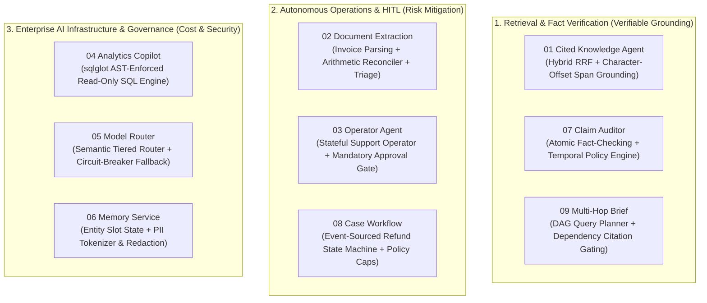

# Enterprise AI Systems Engineering Suite

A production-grade portfolio of **9 enterprise AI systems** demonstrating deterministic guardrails, state-machine orchestration, AST-enforced security, verifiable retrieval, and human-in-the-loop (HITL) workflows.

Built specifically to showcase **senior-level AI engineering capabilities** for both high-impact contract roles (immediate ROI, risk mitigation, operational reliability) and full-time positions (systems architecture, evals-as-code, and production rigor).

---

## Portfolio Architecture



---

## The 9 Systems: Engineering Guarantees & Invariants

Every system is an independent, runnable FastAPI application with its own modern dashboard, unit tests targeting critical failure modes, and automated evaluation scorecards.

| # | System | Port | Business Invariant & Technical Proof |
| :--- | :--- | :--- | :--- |
| **01** | **[Cited Knowledge Agent](01-cited-knowledge-agent/README.md)** | `8001` | **Zero-Hallucination Grounding**: Hybrid BM25 + Gemini vector search with Reciprocal Rank Fusion (RRF). Answers cite verbatim character spans; hallucinated quotes are discarded in code; superseded policies are rejected unless historical context is explicitly requested. |
| **02** | **[Document Extraction](02-document-extraction/README.md)** | `8002` | **Accounting Reconciliation**: Ingests invoices and validates line-item math (`sum(items) + tax - discount == total`). If confidence < 0.85 or math mismatches by > $0.01, automatically routes to human triage. |
| **03** | **[Operator Agent](03-operator-agent/README.md)** | `8003` | **Two-Man Rule Execution**: Stateful agent with step & token caps. External messages/actions are placed in a pending approval queue; no message is ever sent without explicit human sign-off. |
| **04** | **[Analytics Copilot](04-analytics-copilot/README.md)** | `8004` | **AST-Level SQL Safety**: Uses `sqlglot` AST validation to enforce read-only semantics (`SELECT` only, zero DDL/DML, table allowlist). Injects strict `LIMIT` clauses and connects via SQLite `mode=ro`. |
| **05** | **[Model Router](05-model-router/README.md)** | `8005` | **Cost & Latency Optimization**: Tiered semantic router directing simple tasks to lightweight models (`gemini-2.5-flash`) and complex reasoning to frontier models (`gemini-2.5-pro`), complete with circuit-breaker fallbacks. |
| **06** | **[Memory Service](06-memory-service/README.md)** | `8006` | **PII Shield & Entity Slot Memory**: Tracks active entity slots with temporal supersession. Automatically tokenizes and redacts PII (credit cards, SSNs, emails) before prompts leave the network perimeter. |
| **07** | **[Claim Auditor](07-claim-auditor/README.md)** | `8007` | **Automated Fact-Checking**: Deconstructs content into atomic propositions and computes evidence-based verdicts (`SUPPORTED`, `CONTRADICTED`, `SUPERSEDED`, `UNVERIFIABLE`) using exact document spans. |
| **08** | **[Case Workflow](08-case-workflow/README.md)** | `8008` | **Event-Sourced State Machine**: Disputes move strictly through legal transitions (`INTAKE` -> `CLASSIFIED` -> `PROPOSED` -> `APPROVED` -> `EXECUTED`). Enforces hard financial caps per category and idempotent event processing. |
| **09** | **[Multi-Hop Brief](09-multi-hop-brief/README.md)** | `8009` | **Dependency-Gated Synthesis**: Models multi-document reasoning as a DAG. If any intermediate fact lacks a verified citation, the final answer strictly withholds that conclusion rather than guessing. |

---

## Quickstart

### Prerequisites
- Python 3.11+
- Virtual environment at `.venv`
- Google Gemini API key:
  ```env
  GEMINI_API_KEY=your_key_here
  ```

### Running Any Application
To run any of the applications locally, navigate to its directory and run `uvicorn`:

```powershell
# Example: Run 01 Cited Knowledge Agent on Port 8001
cd 01-cited-knowledge-agent
..\.venv\Scripts\python -m uvicorn app.main:app --port 8001 --reload

# Example: Run 04 Analytics Copilot on Port 8004
cd 04-analytics-copilot
..\.venv\Scripts\python -m uvicorn app.main:app --port 8004 --reload
```

Open your browser at `http://127.0.0.1:800X` (where `X` corresponds to the project port).

---

## Automated Testing & Evals

### Running Unit Tests
Every project contains a dedicated test suite verifying its core invariants:

```powershell
cd <project-folder>
..\.venv\Scripts\python -m pytest tests/
```

### Running Quantitative Evals
Each project includes an evaluation harness that benchmarks accuracy, groundedness, latency, and token efficiency against realistic test cases:

```powershell
cd <project-folder>
..\.venv\Scripts\python evals/run_eval.py
```
Scorecards report quantitative metrics (Hit Rate, Verbatim Precision, Refusal Accuracy, Cost Savings) produced dynamically during the run.

---

## Engineering Attribution & AI Pair-Programming

This repository was developed with Gemini and Claude as AI pair-programming assistants. I designed the architecture, the deterministic safety rules and invariants, the state machines, and the verification test suites, and reviewed all code.

